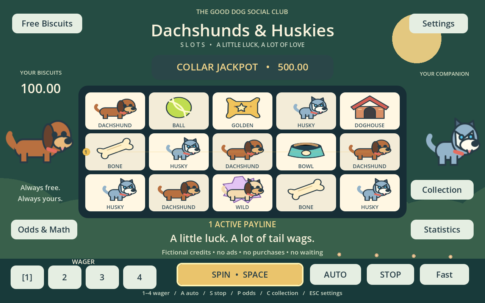
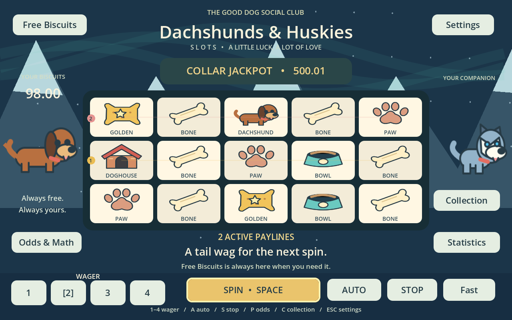

# Dachshunds & Huskies Slots

A cheerful, completely free Godot game about lucky dogs and fictional biscuits.
**No real-money gambling, purchases, ads, cryptocurrency, accounts, cash-out,
paid boosts, energy timers, loot boxes or gameplay tracking.** No game server.
Refill whenever you need biscuits; nothing is ever sold.

**[Play in your browser](https://livonianerd.github.io/dog-themed-godot-slot-machine/)** ·
**[Windows and Linux downloads](https://github.com/livonianerd/dog-themed-godot-slot-machine/releases/latest)** ·
[Builds](https://github.com/livonianerd/dog-themed-godot-slot-machine/actions)



## Play

Start with **100 credits**. Select a wager of 1–4 and press **Spin**. Wins match
3, 4 or 5 symbols from the **leftmost reel**. Multiple paylines can win together.
Numbered active lines remain visible; winning lines and symbols animate.

| Wager | Active paylines |
|---|---|
|1|Middle row|
|2|Middle and top|
|3|Middle, top and bottom|
|4|All three rows and both diagonals|

**Max Bet:** five lines share four credits (0.8 per line), with an additional
**1.5% line-payout bonus**. This disclosed normalization keeps every wager near
103% RTP rather than introducing a 25% jump. Symbols have the same probabilities
at every wager. [Full explanation and paytable](docs/probability-model.md).

- **Wild Puppy** substitutes for ordinary line symbols, never Bonus Bone or Collar.
- **Bonus Bones:** 3 anywhere give 5 free spins, 4 give 8, 5+ give 10. Free spins
  retain the triggering wager and may retrigger through six generations.
- **Dog Park Bonus:** a 1% independent chance each spin. Choose a house to reveal
  a pre-drawn 2×, 3×, 4× or 7× wager prize. No wrong choice or paid entry.
- **Collar Jackpot:** starts at 500, grows by 0.005× each paid wager, and pays the
  whole pot on an independent 1-in-40,000 event. It can hit during free spins.
  The decorative Collar symbol itself does not trigger it. The pot persists.
- **Free Biscuits:** sets your balance to exactly 100 when below 100. No delay,
  ad or penalty. An empty bowl shows a large **Refill to 100** button.
- **Auto:** 10, 25, 50 or continuous. Stops for low credits, bonus/free triggers,
  a jackpot, a Puppy Party or Stop. Stop immediately cancels future spins; the
  already-generated current result finishes. Queued free spins remain available.
- **Normal / Fast:** about 2.5 seconds / 1 second, plus a brief auto-spin gap.
- **Wins:** normal (<5×), Big (5–15×), Huge (15–50×), Puppy Party (50×+), Jackpot.
  These are presentation tiers, never changes to the awarded result. Effects
  are short and do not lock the player into a long celebration.

**SPACE** spin · **1–4** wager · **A** Auto · **S** Stop · **P** odds · **C**
collection · **ESC** settings/close. Every action also has a mouse/touch control.
Landscape mobile, tablets and desktop use aspect-preserving scaling. Compact
windows enlarge button heights. Portrait is not optimized.

Settings include music/effects volume, mute, reduced sounds, reduced animation,
reduced particles, optional gentle shake, and instant/normal/slow payout counting.
Keyboard focus is visibly outlined. Wins have both numbered lines and outlines;
colors are supplementary. **New Game** resets everything only after confirmation.
Audio starts after an interaction, not on browser page load.

## Dogs, themes and collection

**Dachshund Meadow** has warm greens, sunlight, flowers, floppy ears and a calm
melody. **Husky Snow** has mountains, snow, blue eyes, northern lights and its own
melody. Themes affect presentation only and are saved locally.



Dachshund and Husky start unlocked. Each achievement, every 50 spins and every
third bonus helps unlock the next companion/accessory. Eight dog palettes and
eight accessories are available; select an unlocked item in **Collection**.
Accessories visibly decorate the companion. All unlocks are permanent until
New Game or local storage is cleared, and have **zero effect on odds**.

Badges: First Fetch, Long Dog, Snow Dog, Double Trouble, Paw-some, Free Treats,
Dog Park Regular, Top Dog and 1000 Spins. They reward first line win, five dogs,
multiple lines, feature triggers, jackpot and play milestones. No badge is
required to continue. Statistics show current credits/pot, paid/free/total spins,
wagered/won credits, largest win, feature counts, unlocks and observed session
and lifetime RTP. Refills do not inflate RTP.

## Probability and measured simulation

Each visible cell is independently sampled from public symbol weights.
Outcomes resolve **before animation**; there are no manufactured near misses.
A single JSON configuration and the same engine power gameplay, tests and the
headless simulator. Theoretical RTP includes bonuses, all free descendants,
jackpot base awards and progressive contributions.

Latest run: Godot 4.7.2, seed **20260927**, **1,000,000 paid spins at each wager**,
plus all awarded free spins (four million paid spins total).

| Bet | Theoretical RTP | Measured RTP | Payout hit rate |
|---|---:|---:|---:|
|1|103.270%|102.939%|6.544%|
|2|102.635%|102.502%|11.828%|
|3|102.423%|102.045%|16.741%|
|4|103.779%|103.596%|23.246%|

Configured target is approximately **103%**. A return above 100% does not promise
that any short session wins. Free-spin trigger probability is about **0.304%**,
bonus **1%**, jackpot **0.0025%**, each per eligible spin. The million-spin report
includes means, median wins, deviations, no-payout rates, every winning symbol/
length combination, jackpot/bonus/free counts, residual pot and censored session
lengths. [Derivation](docs/probability-model.md) · [raw measured results](docs/simulation-results.json)

```sh
# Godot 4.7.2 executable on PATH as godot:
godot --headless --path . --script scripts/verify_math.gd
godot --headless --path . --script scripts/simulate_slots.gd -- 1000000 20260927
# 10k, 100k, 1m or 10m paid spins PER wager; optional output path:
godot --headless --path . --script scripts/simulate_slots.gd -- 10000000 42 /tmp/results.json
```

## Develop, test and export

Open `project.godot` in [Godot **4.7.2 stable**](https://godotengine.org/download/archive/4.7.2-stable/),
then press F6/F5 to play. GDScript only; no dependencies or asset downloads inside
the game. Original artwork and synthesized audio are checked in.

```sh
# Linux installer for the pinned editor and matching templates:
bash tools/install-godot.sh
.tools/godot --headless --path . --script tests/test_game.gd
.tools/godot --headless --path . --script tests/test_ui.gd
bash tools/build.sh
# Or export separately, after installing templates:
godot --headless --path . --export-release Web build/web/index.html
godot --headless --path . --export-release Windows build/windows/dog-slots.exe
godot --headless --path . --export-release Linux build/linux/dog-slots.x86_64
```

`tools/build.sh` imports assets, verifies exact math, runs engine and UI integration
tests, exports all platforms, and creates desktop ZIPs plus `SHA256SUMS.txt` in
`build/downloads`. On Linux, unzip and run `./dog-slots.x86_64`; preserve or restore
execute permission with `chmod +x dog-slots.x86_64`. On Windows run `dog-slots.exe`.
The desktop PCK is embedded. Builds are unsigned.

Serve Web files over HTTP, not `file://`, for example:

```sh
python3 -m http.server 8765
# Open http://localhost:8765/build/web/
# Optional browser verification (Node.js + Playwright Chromium):
npm install --prefix /tmp/dog-browser playwright
NODE_PATH=/tmp/dog-browser/node_modules node tools/browser-check.cjs
```

Development controls require a **debug build AND** the user argument:

```sh
godot --path . -- --developer
```

The DEV screen supports seeded repeatability, validated custom JSON grids, forced
three/five/diagonal/multiple/wild wins, free spins, bonus, jackpot, raised feature
probabilities, test credits and statistic reset. It uses a separate local save.
Release exports cannot enable the DEV menu, even with the argument.

[Architecture and persistence](docs/architecture.md) · [verification notes](docs/verification.md)

## GitHub Actions, Pages and releases

The repository uses `.github/workflows/build.yml` for three jobs: build/test,
Pages deployment, and versioned release. Every push to **main** exports Web,
Windows x86_64 and Linux x86_64. Pull requests build/test without deployment.
Desktop ZIPs and checksums are downloadable from the workflow's
**desktop-downloads** artifact. **web-build** contains the browser export.

For a fork: **Repository Settings → Pages → Source → GitHub Actions**.
The Pages job uploads the Web export and deploys it with GitHub's Pages actions.
Expected address: `https://USERNAME.github.io/REPOSITORY/`.
All asset references are relative. The single-threaded export needs no special
cross-origin-isolation headers and works beneath the repository subdirectory.

Push a version tag to create a GitHub Release containing both desktop ZIPs and
SHA256 checksums, built and tested from that exact tag:

```sh
git tag v1.0.1
git push origin v1.0.1
```

There are no credentials in the project; CI uses scoped GitHub Actions tokens.
Save files stay on the device (`user://`, browser IndexedDB on Web). Clearing
browser storage, private browsing or changing browser profiles can affect saves.

## Licensing and scope

MIT. All game-specific SVG art and audio are original and reproducible with
`python3 tools/generate_assets.py`; [provenance and engine licenses](docs/asset-licenses.md).
Barks/howls are simple synthesized effects. Dog breeds beyond the two leads
are stylized palette variants, not anatomically detailed models. Portrait,
cloud saves, native mobile packages and real-money features are not included.
Windows export is built automatically; native Windows runtime testing requires
a Windows machine. See verification notes for exactly what was tested.
